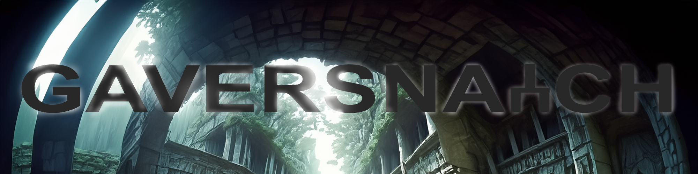

# Prime Solo Project: GAVERSNATCH



Gaversnatch is an innovative web-based game that offers players a unique gaming experience every time they embark on a new adventure. With features like starting new games and loading previous ones, Gaversnatch ensures endless exploration and excitement.

## Features

- **Dynamic Gameplay**: Gaversnatch generates a novel game experience each time a player initiates a new game, guaranteeing freshness and unpredictability by harnessing the power of Google Gemini Pro.
  
- **Game State Persistence**: Players can save their progress and pick up where they left off by loading older games, allowing for seamless continuity in their exploration journey.

- **Custom Game Engine**: Built from the [ground up](https://github.com/gjpopken/spike_dataStructures_tailwind), this custom game engine enables players to navigate seamlessly between different rooms within the game world, fostering immersive exploration and discovery.

## Installation

To get started with Gaversnatch, follow these steps:

1. Fork and clone this repository. CD into the root directory.

2. Install dependencies using npm.

   ```bash
   npm install
   ```

3. Start the development server.

   ```bash
   npm run server
   ```
4. Start the development server.

    ```bash
    npm run server
    ```

5. Open your browser and navigate to `http://localhost:5173/` to play Gaversnatch!

## Aim of the Game
Can you find a way out?

## Usage

- **Starting a New Game**: Click on the "New Game" button to embark on a fresh adventure, where every playthrough promises new challenges and discoveries.
  
- **Loading Previous Games**: Access your saved games by clicking on the "Load Game" button, allowing you to resume your exploration from where you last left off.

## Contributing

We welcome contributions from the community to help enhance Gaversnatch and make it even more engaging for players. If you're interested in contributing, please follow these guidelines:

1. Fork the repository.
2. Create your feature branch (`git checkout -b feature/AmazingFeature`).
3. Commit your changes (`git commit -m 'Add some AmazingFeature'`).
4. Push to the branch (`git push origin feature/AmazingFeature`).
5. Open a pull request.